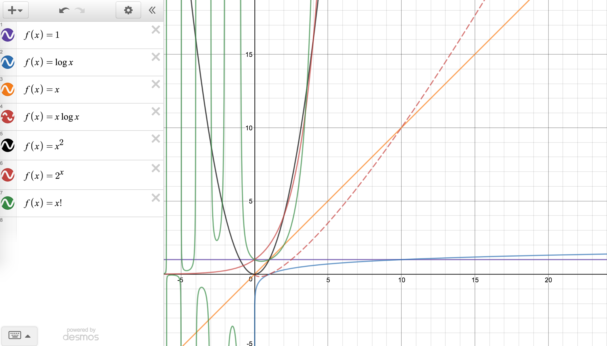

# 五步刷题法（五毒神掌）

## 第一遍

5分钟读题+思考，直接看解法，**比较多解法优劣**，背诵、默写好的解法

## 第二遍

马上自己写，LeetCode提交，多种解法比较、体会、优化

## 第三遍

过了一天后，重复做题，强化不同解法的熟练程度

## 第四遍

过了一周后，反复回来练习相同题目

## 第五遍

面试前一周恢复性训练

# 切题四件套

- Clarification
- Possible solutions
    - compare（time/space)
    - optimal（加强）
- Coding（多写）
- Test cases

# 常见的时间复杂度

类型：最好，最坏，平均，均摊

- O(1)：Constant Complexity 常数复杂度：如 Hash 表、缓存等
- O(log n)：Logarithmic Complexity 对数复杂度：如二分查找、二叉搜索树等
```
for (int i = 1; i < n; i = i * 2) {
    System.out.println("Hey - here comes: " + i);
}
```
- O(n)：Linear Complexity 线性时间复杂度：大多数遍历操作，如二叉树前中后序遍历、图的遍历、搜索算法DFS、BFS
- O(n^2)：N square Complexity 平方：双重 for 循环
- O(n^3)：N square Complexity 立方：三重 for 循环
- O(2^n)：Exponential Complexity 指数：递归的时间复杂度
```
// O(k^n)
int fib(int n) {
    if (n <= 2) return n;
    return fib(n-1) + fib(n-2);
}
```
- O(n!)：Factorial 阶乘

注意：只看最高复杂度的运算

常见复杂度的曲线：

(画图网站为：[https://www.desmos.com/calculator](https://www.desmos.com/calculator))


