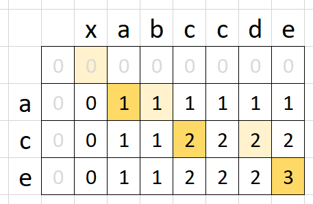

# 动态规划

## 关键点

- 动态规划 和 递归 或者 分治 没有根本上的区别（关键看**有无最优的子结构**，参[120_test.go](./test/120_test.go)中的错误解法）
- **共性：找到重复子问题**
- 差异性：最优子结构、中途可以**淘汰**次优解。三步走：
    1. 最优子结构 opt[n] = best_of(opt[n-1], opt[n-2], ...)
    2. 储存中间状态：opt[i]
    3. 递推公式（美其名曰：状态转移方程 或 DP 方程）
        - Fib：opt[i] = opt[i-1] + opt[i-2]
        - 二维路径：opt[i, j] = opt[i+1, j] + opt[i, j+1]（且判断 opt[i, j]是否为空地）

## 斐波那契数列（一维数组）

递推公式：
```
F(n) = F(n-1) + F(n-2)
```

1. 记忆化搜索（memozation）：加缓存，自顶向下
2. 自底向上：递推（for 循环，所以又叫动态递推），eg: 0，1，1，2，3，5，8，13，……

## 路径计数（二维数组）

可以转换思路，变为自底向上，从右下开始往左上走。

递推公式：（opt = optimal）
```
opt[i, j] = opt[i+1, j] + opt[i, j+1]
```

完整逻辑：
```
if a[i, j] = '空地':
    opt[i, j] = opt[i+1, j] + opt[i, j+1]
else:
    opt[i, j] = 0   // 遇到障碍物，走法为 0
```

## 股票最佳买卖时机（三维数组）

1. 分解子问题：`dp[i][j][0/1]`，第 i 天最多 j 次 交易时，持有或不持有股票可以获得多少利润
2. 状态空间：`dp[i][j][0/1]`，0-不持有，1-持有
3. DP 方程：

```
// 第 i 天不持有股票：可能是前一天就不持有，或者是前一天持有、第 i 天卖了
dp[i][j][0] = max(dp[i-1][k][0], dp[i-1][k][1]+prices[i])
// 第 i 天持有股票：可能是前一天就持有，或者是前一天不持有、第 i 天买入了
dp[i][j][1] = max(dp[i-1][k][0], dp[i-1][k-1][0]-prices[i])
```

上述 DP 方程可以一举解决一系列的股票买卖问题：

- [121.best-time-to-buy-and-sell-stock](./lc/121.best-time-to-buy-and-sell-stock.go)
- [122.best-time-to-buy-and-sell-stock-ii](./lc/122.best-time-to-buy-and-sell-stock-ii.go)
- [123.best-time-to-buy-and-sell-stock-iii](./lc/123.best-time-to-buy-and-sell-stock-iii.go)
- [188.best-time-to-buy-and-sell-stock-iv](./lc/188.best-time-to-buy-and-sell-stock-iv.go)
- [309.best-time-to-buy-and-sell-stock-with-cooldown](./lc/309.best-time-to-buy-and-sell-stock-with-cooldown.go)
- [714.best-time-to-buy-and-sell-stock-with-transaction-fee](./lc/714.best-time-to-buy-and-sell-stock-with-transaction-fee.go)

## 小结

1. 打破自己的思维惯性，形成机器思维（找重复性）
2. 理解复杂逻辑的关键
3. 也是职业进阶的要点要领

## 备注

1. 对于 1143题 LCS 问题（Longest Common Subsequence），感觉如下图示更容易理解：


(原图来自：[https://leetcode.com/problems/longest-common-subsequence/discuss/348884/C%2B%2B-with-picture-O(nm)](https://leetcode.com/problems/longest-common-subsequence/discuss/348884/C%2B%2B-with-picture-O(nm)))

即在原有 `m * n` 表格的基础上，最前面增加一行一列，变成 `(m+1) * (n+1)` 的表格，这样在迭代求解时 for 循环的范围就变成了 `[1, m]`，方便比较上一行/上一列与当前行/列的关系，并更新数据，最终结果位于 `dp[m][n]`。

2. 在解决 DP 问题时，常见技巧包括：

- 在原有数组前增加一行/一列，便于后面 `i-1`、`j-1` 的处理；
- 二维数组的 `dp[i][0]` 和 `dp[0][j]` 的初始化；
- 当只需要一个最终数值、不需要过程中详细步骤时，可以考虑降维存储，降低空间复杂度（如斐波那契数列，可以只存储第 i 个数值，而不需要存储整个数列）；
- 字符串处理时，可以考虑从后往前对比，类似的，二维的 DP 表，可以考虑从右下向左上迭代。