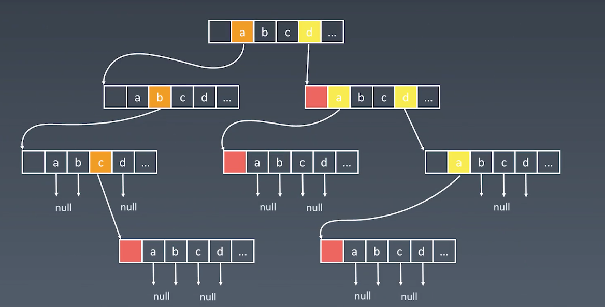

# Trie

## 基本性质

1. 结点本身不存完整单词
2. 从根结点到某一结点，路径上经过的字符连接起来，为该结点对应的字符串
3. 每个结点的所有子结点路径代表的字符都不相同

## 核心思想

- Trie 树的核心思想是空间换时间
- 利用字符串的公共前缀来降低查询时间的开销以达到提高效率的目的

## 结点的内部实现




## 代码模板

```lang=python
class Trie(object):

    def __init__(self):
        self.root = {}
        self.end_of_word = "#"

    def insert(self, word):
        node = self.root
        for char in word:
            node = node.serdefault(char, {})
        node[self.end_of_word] = self.end_of_word

    def search(self, word):
        node = self.root
        for char in word:
            if char not in node:
                return False
            node = node[char]
        return self.end_of_word in node

    def startsWith(self, prefix):
        node = self.root
        for char in prefix:
            if char not in node:
                return False
            node = node[char]
        return True
```