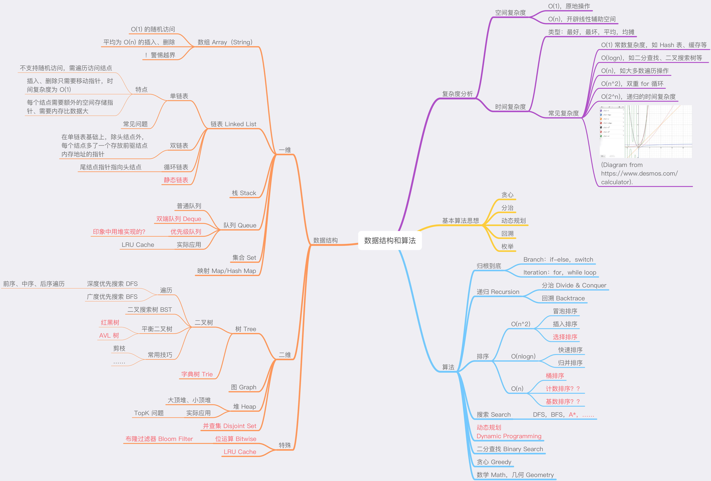
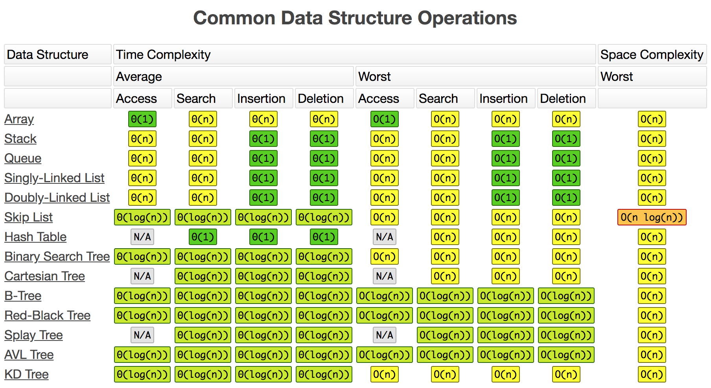
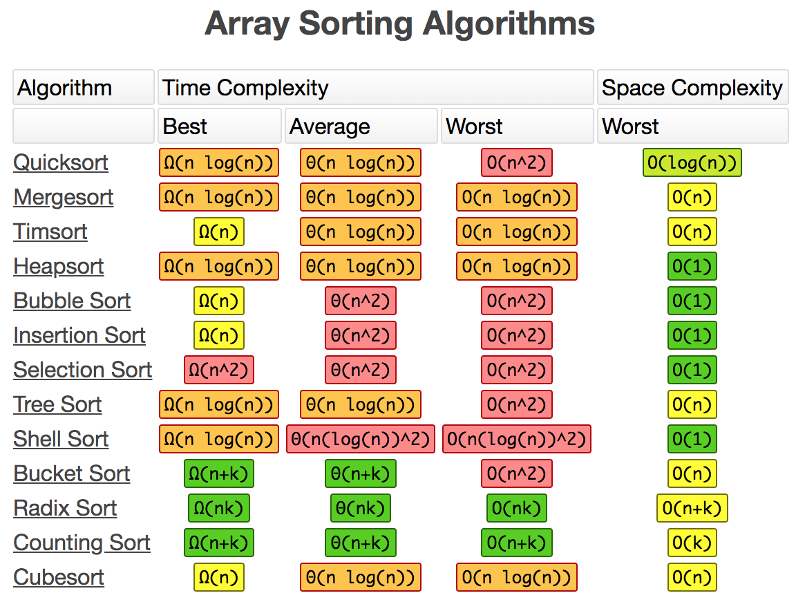

# one-more-step-in-algo

极客时间专栏[《数据结构与算法之美》]((https://time.geekbang.org/column/126))的实现代码和一些笔记。

## 主要关注：

- 来历
- 自身特点
- 适合解决的问题
- 实际的应用场景
- 对应 LeetCode 习题

**10个数据结构：**
- ~~数组~~
- ~~链表~~
- ~~栈~~
- ~~队列~~
- 散列表
- 二叉树
- 堆
- 跳表
- 图
- Trie树

**算法：**
- 递归
- 排序
- 二分查找
- 搜索
- 哈希算法
- 贪心算法
- 分治算法
- 回溯算法
- 动态规划
- 字符串匹配算法

## 常见算法复杂度

（来自 [https://www.bigocheatsheet.com](https://www.bigocheatsheet.com))

## 常见排序算法复杂度

（来自 [https://www.bigocheatsheet.com](https://www.bigocheatsheet.com))

## 被忽略的 Go 实现的小问题

- append 对于 runtime 的影响
- for-loop
- http package：[https://medium.com/@nate510/don-t-use-go-s-default-http-client-4804cb19f779](https://medium.com/@nate510/don-t-use-go-s-default-http-client-4804cb19f779)